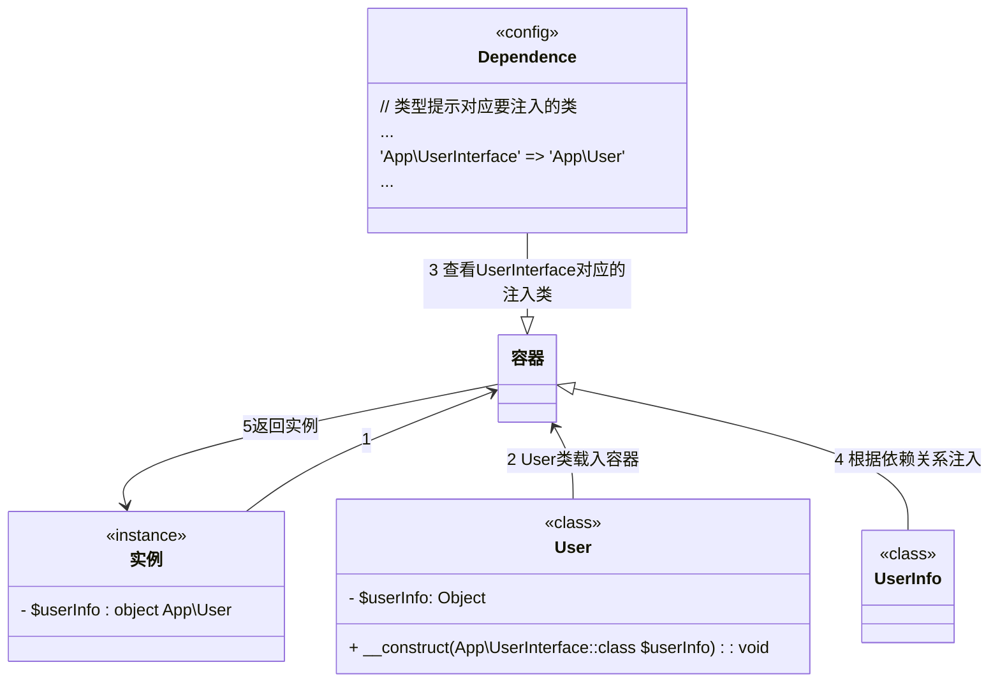

layout: draft
title: 【php】hyperf笔记-依赖注入
author: 吴楚衡
tags:
  - 依赖注入
  - hyperf
categories:
  - php
date: 2020-02-04 06:41:00
---
### 什么是依赖注入？
&emsp;依赖注入就是`AOP`切面编程，把一个需求实例化的类通过反射机制在一个统一的地方进行实例化，期间通过类型提示的参数对应的依赖类赋值给这个类，然后返回这个实例。

  

![](/images/202002051532.PNG
<!--more->
官方的`Di`解释是:即“依赖注入”：组件之间依赖关系由容器在运行期决定,由容器动态的将来依赖关系注入到对象之中。  
&emsp;由于实例都是统一从容器中获取，使得只要修改类型提示关联的类就能全局生效，或者类的单例使用。